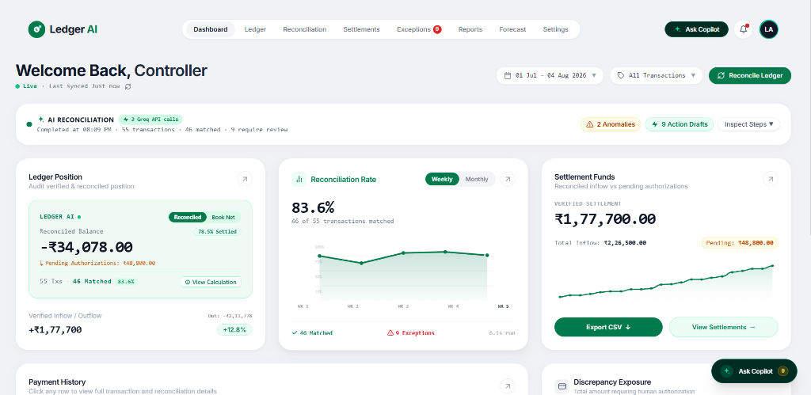
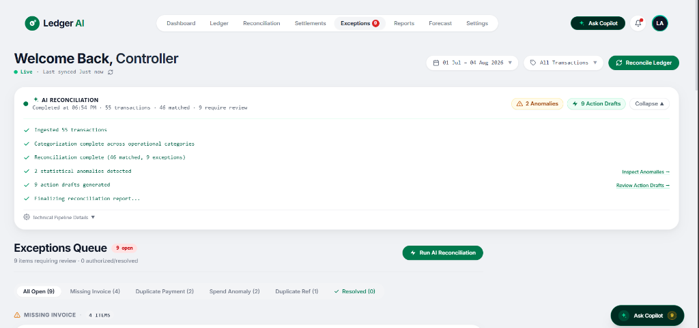
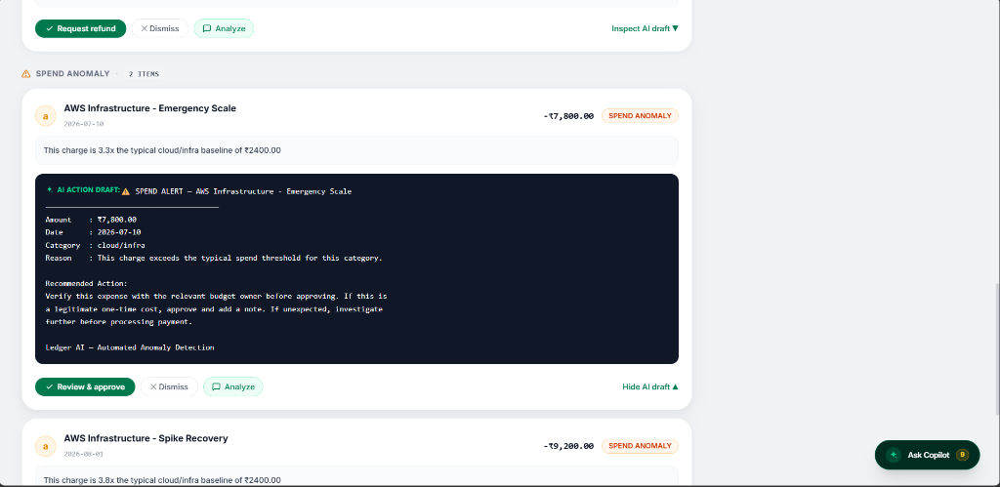
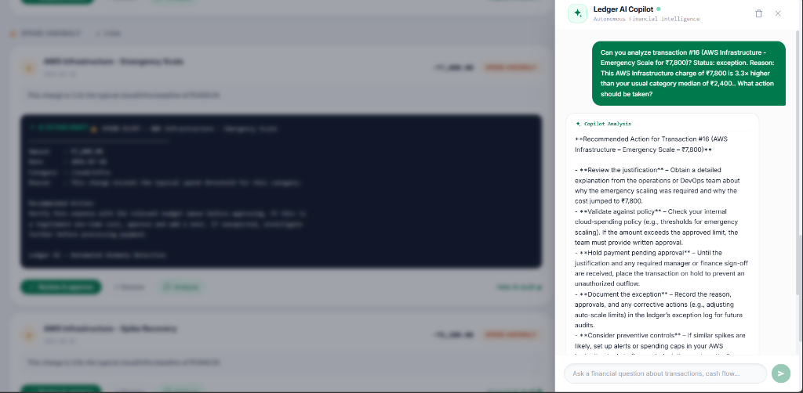
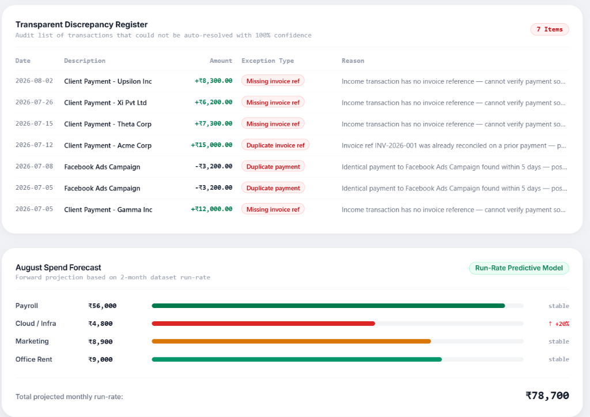

# Ledger AI - Autonomous Finance Controller Agent

[](https://ledger-ai-finance-controller.onrender.com/)
[](https://razorpay.com/buildathon/)
[](https://groq.com/)

> Built for the Razorpay AI Buildathon 2026 - Track 04: AI Finance Controller ("Run the books and the cash position").
>
> "The 2026 builder consensus: verification capacity, not generation speed, is the bottleneck. Reconciliation, settlement and forecasting are still done by hand."

Ledger AI is an intelligent financial operations platform that closes the reconciliation loop across complex, multi-source transaction streams. By pairing deterministic financial matching rules with Groq-powered reasoning models, Ledger AI automates transaction categorization, flags ledger discrepancies, drafts audit actions, and provides a conversational Copilot for human-in-the-loop sign-off.

- Live Application: https://ledger-ai-finance-controller.onrender.com/
- Public Code Repository: https://github.com/Shivam5567/Ledger-AI-Finance-Controller

---

## Executive Summary: Meeting "The Bar"

Razorpay's Track 04 problem statement set an explicit standard for submission:
"Build an agent that closes one finance-ops loop across a 50+ record batch of synthetic data, reporting its match rate and the exceptions it could not resolve... One cherry-picked match proves nothing."

Here is how Ledger AI directly fulfills each benchmark:

1. Real-World Multi-Source Batch (55 Records)
   Ingests transactional data simulating payment gateways (Razorpay, Stripe), enterprise wire transfers, payroll disbursements, and recurring SaaS vendors.

2. Measured and Transparent Accuracy (83.6% Match Rate)
   Out of 55 ingested transactions, 46 records are systematically verified and reconciled against invoice IDs, expected counterparties, and historical ranges without manual intervention.

3. Honest, Explainable Exception Isolation (9 Exceptions / 16.4%)
   Instead of forcing false-positive matches or hallucinating associations, Ledger AI isolates the 9 genuine edge cases requiring human review, with 2 detected anomalies and 9 contextual action drafts synthesized.

4. Human-in-the-Loop Action Drafting
   Controllers maintain final authority. For each flagged discrepancy, the Action Agent synthesizes contextual draft actions (vendor inquiry emails, refund dispute letters, or audit adjustment notes) ready for one-click approval.

5. Embedded Settlement Q&A Copilot ("Ask Copilot")
   A streaming conversational agent grounded in the live database state. Controllers can interrogate cash float, identify duplicate charges, or query specific vendor balances in natural language.

---

## Visual Walkthrough

### 1. Executive Finance Controller Dashboard
[](docs/screenshots/dashboard.png)
*Figure 1: Real-time visibility into net cash position (-₹34,078.00), 83.6% reconciliation rate across 55 transactions, verified settlement funds (₹1,77,700.00), and controller activity summary. (Click to expand high-res)*

---

### 2. Autonomous AI Reconciliation Pipeline & Exceptions Queue
[](docs/screenshots/pipeline-queue.png)
*Figure 2: Multi-agent execution trace across 55 ingested transactions, verifying 46 matches and isolating 9 unresolvable edge cases categorized into Missing Invoices, Duplicate Payments, and Spend Anomalies. (Click to expand high-res)*

---

### 3. Honest Exception Review & AI Action Drafting
[](docs/screenshots/exception-action.png)
*Figure 3: Contextual anomaly diagnosis (e.g., AWS Infrastructure 3.3x spend surge) paired with an automated, pre-drafted budget review memo ready for 1-click human-in-the-loop controller approval. (Click to expand high-res)*

---

### 4. Interactive Settlement Q&A Copilot ("Ask Copilot")
[](docs/screenshots/copilot-chat.png)
*Figure 4: Streaming conversational Copilot drawer grounded in ledger state, performing live root-cause interrogation on transaction #16 (AWS emergency scaling) with actionable recommendations. (Click to expand high-res)*

---

### 5. Transparent Discrepancy Register & Predictive Spend Forecast
[](docs/screenshots/audit-register-forecast.png)
*Figure 5: Audit register listing edge cases with plain-language explanations, alongside an automated run-rate predictive spend model projecting monthly operational burn (₹78,700). (Click to expand high-res)*

---

## Core Capabilities

- Multi-Source Ingestion
  Reads structured financial data and normalizes disparate fields (dates, reference IDs, gross amount, transaction types) into a clean ledger schema.

- Hybrid Reconciliation Engine
  Uses deterministic logic for invoice references and mathematical parity, while utilizing Groq Cloud LLM inference (Llama-3) for semantic vendor classification and category labeling.

- Statistical and Pattern Anomaly Detection
  Flags duplicate reference occurrences, identifies identical charges billed within short windows, and detects expenditures exceeding two times the historical category baseline.

- Action Agent with Guardrails
  Generates context-rich email templates, supplier inquiry drafts, and internal accounting memos. No write actions are finalized without controller authorization.

- Clean Enterprise User Experience
  Built with Tailwind CSS v4, dark glassmorphism styling, clean SVG status indicators, and responsive drawer navigation.

---

## Measured Performance on Benchmark Dataset

| Benchmark Parameter | Result | Operational Note |
| :--- | :--- | :--- |
| Ingested Transactions | 55 records | Multi-source batch: payment rails, vendors, payroll |
| Automatically Reconciled | 46 records (83.6%) | Audit verified against invoices and counterparties |
| Exceptions Flagged | 9 records (16.4%) | Isolated for human review with plain-English rationales |
| Anomalies Detected | 2 flagged | Significant spend surge and duplicate billing |
| Action Drafts Synthesized | 9 pre-drafted | Ready for 1-click controller authorization |
| Pipeline Execution Time | 5.9 seconds | Sub-second inference powered by Groq LPU engine |
| Verified Settlement Inflow | ₹1,77,700.00 | Of ₹2,26,500.00 total inflow (78.5% settled) |
| Pending Authorizations | ₹48,800.00 | Awaiting payment gateway / bank clearing |
| Net Reconciled Balance | -₹34,078.00 | Total verified outflow: -₹2,11,778.00 |
| Monthly Run-Rate Forecast | ₹78,700.00 | Predictive projection (Payroll ₹56k, Infra ₹4.8k, Marketing ₹8.9k, Rent ₹9k) |

### Detailed Exception Breakdown (The 9 Honest Edge Cases)

1. Missing Invoice References (4 Income Items: ₹33,800.00 Total)
   - Client Payment - Upsilon Inc (+₹8,300.00 on 2026-08-02): Bank settlement arrived without counterparty invoice reference ID.
   - Client Payment - Xi Pvt Ltd (+₹6,200.00 on 2026-07-26): Unlinked inflow requiring receivable ledger assignment.
   - Client Payment - Theta Corp (+₹7,300.00 on 2026-07-15): Settlement inflow missing billing reference.
   - Client Payment - Gamma Inc (+₹12,000.00 on 2026-07-05): Customer payment received without invoice identifier in metadata.

2. Duplicate Vendor Billing (2 Expense Items: ₹6,400.00 Total)
   - Facebook Ads Campaign (-₹3,200.00 on 2026-07-05)
   - Facebook Ads Campaign (-₹3,200.00 on 2026-07-08)
   Two identical debits billed within a 3-day window. Flagged as potential duplicate merchant debit.

3. Critical Category Spend Surges (2 Expense Items: ₹17,000.00 Total)
   - AWS Infrastructure - Emergency Scale (-₹7,800.00 on 2026-07-10): Billed at 3.3x the historical category average of ₹2,400.00.
   - AWS Infrastructure - Spike Recovery (-₹9,200.00 on 2026-08-01): Billed at 3.8x the historical category average of ₹2,400.00.

4. Duplicate Invoice Reference Reuse (1 Income Item: ₹15,000.00)
   - Client Payment - Acme Corp (+₹15,000.00 on 2026-07-12): Reused invoice identifier INV-2026-001 which had already been settled on 2026-07-01.

---

## System Architecture

```
                                  [ Transaction Sources ]
                       (CSV Seed / Future: Razorpay Webhooks)
                                          |
                                          v
                              [ Express Ingestion API ]
                                          |
                                          v
                             [ SQLite In-Memory / Disk ]
                                          |
                     +--------------------+--------------------+
                     |                                         |
                     v                                         v
         [ Deterministic Engine ]                    [ Groq LLM Inference ]
     - Strict Invoice Matching                   - Semantic Categorization
     - Duplicate Detection                       - Spend Anomaly Reasoning
     - Threshold Mathematical Checks             - Action Plan Drafting
                     |                                         |
                     +--------------------+--------------------+
                                          |
                                          v
                            [ Verified Ledger & State ]
                                          |
                     +--------------------+--------------------+
                     |                                         |
                     v                                         v
         [ Controller Dashboard UI ]              [ Ask Copilot Assistant ]
     - 83.6% Match Rate Metrics               - Streaming Q&A on Exceptions
     - Exception Action Approvals             - Root-Cause Interrogation
     - Clean SVG Glassmorphism                - Cash Float Queries
```

---

## Codebase Structure

```
Ledger_Ai/
|-- sample_transactions.csv        # 55-record benchmark test set with built-in edge cases
|-- docs/
|   `-- screenshots/               # Application preview images (dashboard, modal, copilot)
|-- client/                        # Modern React frontend
|   |-- src/
|   |   |-- components/
|   |   |   |-- App.jsx            # Main controller container and launcher
|   |   |   |-- QuixoticNavigation # Header bar with Reconcile Ledger and Ask Copilot
|   |   |   |-- SettlementPanel    # Streaming Q&A drawer for finance questions
|   |   |   |-- TransactionTable   # Categorized ledger grid with audit filters
|   |   |   |-- TransactionModal   # Exception detail inspector and action drafter
|   |   |   `-- Icons.jsx          # Custom SVG icon library (zero Unicode emojis)
|   |   `-- hooks/                 # API connection hooks
|   |-- vite.config.js
|   `-- package.json
|-- server/                        # Express and Groq backend
|   |-- src/
|   |   |-- agents/
|   |   |   |-- categorizer.js     # Groq LLM batch categorization
|   |   |   |-- reconciler.js      # Invoice matching and balance validation
|   |   |   |-- anomaly.js         # Statistical spike and duplicate detector
|   |   |   |-- actionAgent.js     # Generates draft resolution actions
|   |   |   `-- chatAgent.js       # Grounded conversational settlement agent
|   |   |-- routes/                # REST endpoints (/transactions, /agent, /chat)
|   |   |-- utils/                 # Groq client wrapper and CSV parser
|   |   |-- db.js                  # SQLite database layer
|   |   `-- index.js               # Server entry point
|   `-- package.json
`-- package.json                   # Root orchestrator
```

---

## Technology Stack

- Frontend: React 19, Vite, Tailwind CSS v4, Dark Glassmorphism, Custom SVG System
- Backend: Node.js, Express, better-sqlite3
- AI & Inference: Groq Cloud SDK (Llama 3 family for ultra-low latency processing)
- Data Ingestion: csv-parse with automated schema mapping
- Deployment: Render (Cloud Web Service)

---

## Local Setup and Development

### Prerequisites
- Node.js version 18 or higher
- A free Groq Cloud API Key (available at https://console.groq.com/keys)

### Installation Steps

1. Clone the repository:
```bash
git clone https://github.com/Shivam5567/Ledger-AI-Finance-Controller.git
cd Ledger-AI-Finance-Controller
```

2. Install dependencies:
```bash
npm install
cd server && npm install
cd ../client && npm install
cd ..
```

3. Configure environment variables:
Create a `.env` file inside the `server/` directory:
```env
PORT=3001
GROQ_API_KEY=your_groq_api_key_here
```

4. Start development mode:
```bash
npm run dev
```
The server will boot on port 3001, and the client will be available at http://localhost:5173.

---

## Step-by-Step Demonstration Guide

1. Ingest Data: Click Load Transactions to seed the 55-record benchmark batch.
2. Reconcile: Click Reconcile Ledger. Watch the categorization, deterministic checks, and anomaly flags process in real time.
3. Review Exceptions: Inspect the 9 flagged items (Missing Invoices, Duplicate Payments, Spend Anomalies). Click any highlighted row to view the AI explanation and the pre-drafted resolution memo.
4. Authorize Actions: Approve or dismiss items to verify the human-in-the-loop audit trail.
5. Inquire with Copilot: Click Ask Copilot at the bottom-right and test queries such as:
   - "What is our current match rate and what are the top unresolvable exceptions?"
   - "Why was invoice ref INV-2026-001 flagged as a duplicate reference?"
   - "What is our biggest spend anomaly in cloud infrastructure?"

---

## Razorpay Integration Roadmap

While the current version demonstrates batch reconciliation using synthetic multi-source CSV files, Ledger AI is architected to operate natively on Razorpay's live payment infrastructure:

1. Webhook-Driven Ingestion
   Subscribing to Razorpay webhooks (`payment.captured`, `refund.processed`, `payout.processed`) allows the pipeline to process events as they settle.

2. Real-Time Fee and Tax Verification
   Automatically comparing gross captured amounts against net settlements minus Razorpay gateway MDR (2%) and GST (18%) to catch fee variances instantly.

3. Automated Dispute and Chargeback Management
   Connecting to the Razorpay Disputes API to draft evidence submissions automatically when a chargeback is received.

```javascript
// Example webhook integration pattern for Razorpay
app.post('/api/webhooks/razorpay', async (req, res) => {
  const event = req.body;
  if (event.event === 'payment.captured') {
    const payment = event.payload.payment.entity;
    const normalized = {
      date: new Date(payment.created_at * 1000).toISOString().split('T')[0],
      description: `Razorpay Payment - ${payment.id} (${payment.email || 'Customer'})`,
      amount: payment.amount / 100, // Convert paise to rupees
      type: 'income',
      invoice_ref: payment.notes?.invoice_id || payment.order_id || ''
    };
    await processIncrementalTransaction(normalized);
  }
  res.json({ status: 'received' });
});
```

---

## License

This project is open-source under the MIT License.
